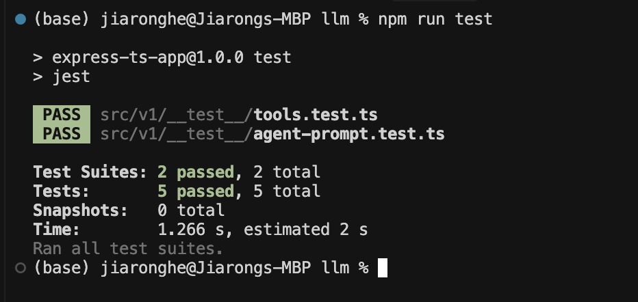

# Lemon Law AI Assistant

# Table of Contents

- [How to Run](#how-to-run-the-apps)
- [Lemon Law Rules](#lemon-law)
- [Backend Architecture](#backend)
  - [Single Agent (v1)](#single-agent-v1)
  - [LangGraph Workflow (v2)](#langgraph-workflow-v2)
- [Frontend Implementation](#frontend)
- [Development &amp; Testing](#others)
- [LangChain vs LangGraph](#langchain-vs-langgraph)

# How to run the apps

### **BE**

```bash
  # llm folder
  cd llm

  # Create .env file
  cp .env.example .env
  
  # Start services
  docker-compose up -d
  
  # Check services
  docker-compose ps
  
  # View logs
  docker-compose logs -f
  
  # Stop services
  docker-compose down

  # Run linter test
  npm run lint

  # Run jest tests
  npm run test

  # Create langsmith dataset
  npm run create-langsmith-dataset

  # Run langsmith evaluation
  npm run langsmith-eval
```

- Express server on port 3000 (Single Agent)
- Express server on port 3001 (LangGraph Workflow)
- Redis on port 6379

### **FE**

```bash
  # react folder
  cd web

  # node version
  nvm use 22.14

  # install & start
  npm install

  npm start
```

- Serves on port 3002


# Lemon Law

### **lemon_rules.json**
  - restructured & llm ready content

```
[
  {
    "manufacturers": [
      "Ford", "GM", "Chrysler", "Honda", "Mazda", "Mercedes Benz",
      "Mitsubishi", "Nissan", "Subaru", "Tata", "Tesla"
    ],
    "rules": [
      {
        "min_repair_orders": 1,
        "max_repair_orders": 2,
        "days_oos": 30,
        "vehicle_age_years": 2,
        "mileage": 24000
      },
      {
        "min_repair_orders": 3,
        "within_mfr_warranty": true
      }
    ]
  },...
]
```

### **Prerequisites**
  - manufacturer list
  - greater than OOS, if applicable
  - less than vehicle age, if applicable
  - less than mileage, if applicable
  - within warranty period, if applicable
  - within specific repair type, if applicable
### **Optimization**
  - reduce the number of inquiries in such scenario
  - return false when invalidate precondition
  - dynamic collect necessary information based on previous context
### **Validation**
  - manufacturer:                         enum
  - number of repair orders:        number
  - repair type:                              optional[enum]
  - days oos:                                 optional[number]
  - vehicle age:                             optional[number]
  - mileage:                                   optional[number]
  - within MFR period:                  optional[bool]

# Backend

### **Variables used in demo**

- `manufacturer`
- `number of repair orders`
- `repair type`
- `days oos`
- `vehicle age`
- `mileage`
- `within MFR period`

### **Agent framework**

- `langchain, langgraph, langsmith`

### **Unit test**

- `jest` - tool, prompt, etc.
  

### **Dataset**

- `langsmith` - dataset
  

### **Evaluation**

- `langsmith` - correctness evals
  

### **Tracer & logging**

- `langsmith`
  

### Single Agent (v1)

- **Prompt**                                      [llm/src/v1/agent-prompt.ts]
  - history summarization
- **Memory**                                    [llm/src/v1/memory.ts]
  - redis persistent
- **Tool**                                           [llm/src/v1/tools.ts]
  - agent tool calling

### Langgraph Workflow (v2)

- **Prompt**                                  [llm/src/v2/agent-prompt.ts]
- **Memory**                                 [llm/src/v2/memory.ts]
  - in-memory storage
- **Tool**                                        [llm/src/v1/tools.ts]
  - tool node
- **Nodes**                                    [llm/src/v2/nodes.ts]
- **State Machine**                       [llm/src/v2/workflow-builder.ts]
- **Edge & Conditional Edge**


# Frontend

- websocket: 3000 & 3001                [web/src/pages/Home.tsx]
- support langchain single agent
- support langgraph multi-agent workflow
- reset with new sessionId & start a new conversation
- timer elapsed timer
- streaming response
- 

# LangChain vs LangGraph

### Performance Comparison

- **Single Agent (LangChain)**

  - Faster response time
  - Simpler architecture
  - Direct tool calling
  - Suitable for straightforward tasks
- **Multi-Agent (LangGraph)**

  - More flexible and extensible
  - Supports complex workflows
  - Better for multi-step reasoning
  - Enables advanced agent patterns

### LangGraph Advanced Patterns

1. **Human-in-the-Loop**

   - Interactive decision making
   - User feedback integration
   - Dynamic workflow adjustment
   - Example: Legal case review with human verification
2. **Corrective RAF (Reasoning and Acting Framework)**

   - Self-correction mechanisms
   - Error recovery
   - Adaptive decision making
   - Example: Legal rule interpretation with fallback strategies
3. **Collaborative Agents**

   - Multi-agent cooperation
   - Specialized role assignment
   - Shared memory and context
   - Example: Legal team simulation with different expertise
4. **Supervision Patterns**

   - Hierarchical control
   - Quality assurance
   - Progress monitoring
   - Example: Senior lawyer supervising junior agents
5. **Hierarchical Teams**

   - Multi-level agent organization
   - Task delegation
   - Specialized sub-teams
   - Example: Legal department structure simulation

### Use Case Selection

- Use Single Agent when:

  - Task is straightforward
  - Response time is critical
  - Simple tool calling is sufficient
- Use LangGraph when:

  - Complex workflow is needed
  - Multiple agents required
  - Advanced patterns needed
  - Extensibility is important

# Others

- github actions
  - linter check:
    - `cd llm && npm run lint`
  - unit tests:
    - `cd llm && npm run test`
